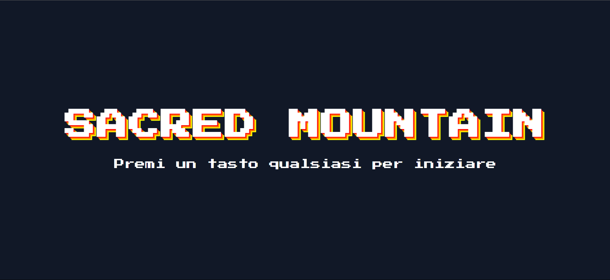

Benvenuto in _Sacred Mountain_, un gioco narrativo a scelte multiple sviluppato con React.  
Questa applicazione si collega ad un backend Java Spring Boot e carica scene, scelte e progressi utente direttamente da un database PostgreSQL.

_Link alla repository backend_
https://github.com/AngeloZorzi/Sacred-Mountain_Backend_Capstone_Project.git

_Funzionalità frontend_

- Login e registrazione utente
- Dashboard personalizzata con stato di avanzamento
- Visualizzazione dinamica delle scene e rispettive immagini
- Sistema di scelte a bivi con salvataggio dello stato
- Interfaccia per Admin con gestione punteggio e utenti
- Scelte e finali sbloccabili solo con determinati prerequisiti

_Installazione_
Requisiti:

- Node.js v16+
- PostgreSQL installato e avviato
- Backend Java (Spring Boot) disponibile e funzionante
- Dump SQL (`data.sql`) fornito

Installazione frontend:

- Clona repository frontend
- Aprire la cartella da terminale
- npm install
- npm run dev

Installazione backend:

- Clona repository backend
- Esegui da Intellij o programma di preferenza
- Assicurati di avere application.properties o env.properties
- il frontend gira in locale sulla porta 8081, quindi in application.properties scrivere:  
  server.port=8081
- application.properties d'esempio:

---

server.port=8081
logging.level.org.hibernate.tool.schema=ERROR
spring.servlet.multipart.enabled=true
spring.servlet.multipart.max-file-size=10MB
spring.servlet.multipart.max-request-size=10MB

spring.datasource.url=jdbc:postgresql://localhost:(inserisci la tua porta)/sacred_mountain
spring.datasource.username= il_tuo_username
spring.datasource.password= La_tua_password
spring.datasource.driver-class-name=org.postgresql.Driver
spring.jpa.hibernate.ddl-auto=update

jwt.secret=US3N3cOjkbGz9nq3E+qv1LZKMG9scqGPRrKwhWgA6P6vI5DyQK8IRLzwrY2fE+6VpmNoywWvbMFUN4KkT8GqEw==
jwt.expiration=3600000 durata token : 1h

---

- Ricorda di non condividere i tuoi dati con nessuno!!!

Configurazione PostgreSQL:
Per far funzionare correttamente il progetto, è necessario importare il database PostgreSQL. All'interno della cartella del backend troverai due file:

- `schema.sql` → definisce le tabelle e la struttura del database
- `data.sql` → inserisce i dati (scene, scelte, utenti demo)

- Apri PostgreSQL e crea un nuovo database
- Importare data.sql e schema.sql --> 2 metodi:

1. Da terminale, nella cartella in cui hai i file
   psql -U nome_utente -d sacred_mountain -f schema.sql
   psql -U nome_utente -d sacred_mountain -f data.sql

   Ti verrà richiesta la password di PostgreSQL per poter procedere

2. Apri pgAdmin, tasto destro sul DB e clicca Query Tool, da lì incolla i due file ed esegui

_Informazioni_

Il gioco è ancora in fase di demo (v1.0.0) le repository verranno aggiornate quando una nuova versione sarà pronta.
Per qualsiasi problema o collaborazione vedere la sezione Contatti.

_Implementazioni future:_

- Possibilità di creare la propria storia
- Implementazione di nuove ramificazioni e finali
- Implementazione di nuove animazioni e musiche

_Credits_

- Un ringraziamento particolare alle community di OpenGameArt e Reddit r/PixelArt
- Animazioni create da Angelo Zorzi (that's Me!) tramite Piskel.
- Story made by Angelo Zorzi (that's Me!)

_Contatti_

- email: astro.drg666@gmail.com
- git: https://github.com/AngeloZorzi
